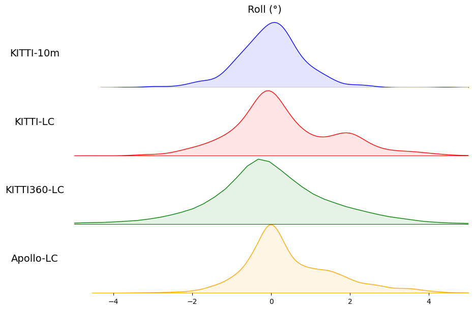

# LiDAR-Registration-Benchmark
## Introduction
This repository provides the benchmark for **LiDAR-based 3D registration**. Currently, we support the following datasets (**welcome** to contribute more datasets):
- [KITTI Odometry](http://www.cvlibs.net/datasets/kitti/eval_odometry.php)
- [KITTI-360](http://www.cvlibs.net/datasets/kitti-360/)
- [Apollo-SouthBay](https://developer.apollo.auto/southbay.html)

The objective of this benchmark is to assess the performance of LiDAR-based 3D registration algorithms in challenging outdoor environments. We offer a test set that includes ground truth poses for each dataset. In comparison to the commonly used KITTI-10m benchmark, which is utilized in most deep-learning-based studies, our point cloud pairs present greater challenges due to the following factors:
- The point cloud pairs are gathered in **loop-closure** scenarios, which are more challenging than the temporally adjacent point cloud pairs.
- These three datasets encompass diverse outdoor environments, including **urban, highway, and suburban areas**.
- In contrast to the mere 556 frames in KITTI-10m benchmark, we provide **3325** frames in KITTI Odometry, **18469** frames in KITTI-360, and **55118** frames in Apollo-SouthBay with a downsampled rate of 2m.
- The translation and rotation of the point cloud pairs exceed those in the KITTI-10m benchmark, spanning a range of **0-40m** and **-180-180 degrees**, respectively, as illustrated in the following figure.

|  |  |
|:--:|:--:|
|  |  |
|:--:|:--:|

For the evaluation of global registration, the registration is considered successful if the estimated pose is within a deviation of **5 degrees** from the ground truth rotation and **2 meters** from the ground truth translation. These thresholds of 5 degrees and 2 meters for rotation and translation, respectively, are in line with the settings employed by state-of-the-art methods.
## Quick Start
### Pairwise Registration
If you want to get a good result without training any network, try to install [teaserpp_python](https://github.com/MIT-SPARK/TEASER-plusplus) and [open3d](http://www.open3d.org/docs/release/index.html) and run the following command to see a simple demo:
```angular2html
python examples/demo_teaser_fpfh.py
```

And you will see the following results (before and after registration):
|  |  |
|:--:|:--:|

### Comprehensive Evaluation

We have prepared the test set files in the [benchmarks](benchmarks) folder. Each file is named according to the translation range of the point cloud pairs. For instance, [test_0_10.txt](benchmarks/kitti_lc/test_0_10.txt) indicates that the translation range of the point cloud pairs is between 0 and 10 meters. Each line of the file contains the sequence ID and frame ID of the point cloud pairs, along with their corresponding ground truth pose.

To evaluate your method, please refer to [evaluate.py](examples/evaluate.py). For example, to evaluate TEASER with FPFH on the test set, please run the following command:
```
# Identify the path of KITTI Odometry dataset in the config file 'configs/dataset.yaml'
# Evaluate on KITTI-10m dataset (you will find a better result than the result reported in the paper:))
python examples/evaluate.py --test_file benchmarks/kitti_10m/test.txt
```
```
# Evaluate on KITTI loop-closure dataset with a translation range of 0-10m
python examples/evaluate.py --test_file benchmarks/kitti_lc/test_0_10.txt
```

## Dataset Preparation and Test Set Generation
### KITTI
Download the KITTI odometry dataset from [KITTI Odometry Benchmark](http://www.cvlibs.net/datasets/kitti/eval_odometry.php). The folder structure should be like:
```angular2html
data_odometry_velodyne/dataset
└── sequences
    ├── 00
    │   ├── calib.txt
    │   ├── times.txt
    │   └── velodyne
    |── ...
```
Note that the poses provided by KITTI are not accurate enough, we use the ground truth poses provided by [SemanticKITTI](http://semantic-kitti.org/dataset.html#format) to evaluate the performance of our method. See [sem_kitti_poses](./benchmarks/sem_kitti_poses) for more details.
### KITTI-360
Download the KITTI-360 dataset from [KITTI-360](http://www.cvlibs.net/datasets/kitti-360/). The folder structure should be like:
```angular2html
KITTI-360/
├── calibration
│   ├── calib_cam_to_pose.txt
│   ├── calib_cam_to_velo.txt
│   ├── ...
├── data_3d_raw
│   ├── 2013_05_28_drive_0000_sync
│   ├── ...
├── data_poses
│   ├── 2013_05_28_drive_0000_sync
│   ├── ...
```
### Apollo
Download the Apollo dataset from [Apollo-SouthBay](https://developer.apollo.auto/southbay.html). The folder structure should be like:
```angular2html
Apollo/
├── MapData
│   ├── BaylandsToSeafood
│   ├── ColumbiaPark
│   ├── HighWay237
│   ├── MathildaAVE
│   ├── SanJoseDowntown
│   └── SunnyvaleBigloop
├── TestData
│   ├── BaylandsToSeafood
│   ├── ColumbiaPark
│   ├── HighWay237
│   ├── MathildaAVE
│   ├── SanJoseDowntown
│   └── SunnyvaleBigloop
└── TrainData
    ├── BaylandsToSeafood
    ├── ColumbiaPark
    ├── HighWay237
    ├── MathildaAVE
    └── SanJoseDowntown
```

### Test Set Generation
Modify the `dataset.yaml` file to specify the dataset path. For example,
```angular2html
# configs/dataset.yaml
kitti_root: /media/qzj/Document/datasets/KITTI/odometry/data_odometry_velodyne/dataset/
apollo_root: /media/qzj/Document/datasets/Apollo
kitti360_root: /media/qzj/Document/datasets/KITTI-360

# parameters for creating the benchmark
sample_interval: 2 # meters for downsample the point cloud pairs
skip_frames: 250 # skip frames for loop closure detection
```

Run the following command to generate the test set:
```angular2html
python examples/generate_test_set.py --dataset kitti_lc
python examples/generate_test_set.py --dataset kitti_10m
python examples/generate_test_set.py --dataset kitti360_lc
python examples/generate_test_set.py --dataset apollo_lc
```

Check the generated test set in the folder [benchmarks](benchmarks). If you want to check the ground truth poses, please refer to [check_poses.py](examples/check_poses.py).

**Notes:** when it comes to deep learning-based methods, it is recommended to utilize sequential point clouds for training their networks.

### Evaluation Results of State-of-the-art Methods

<div align="center">
    
</div>

<div align="center">
    
</div>

<div align="center">
    
</div>

More details can be found in [G3Reg](https://arxiv.org/abs/2308.11573).
